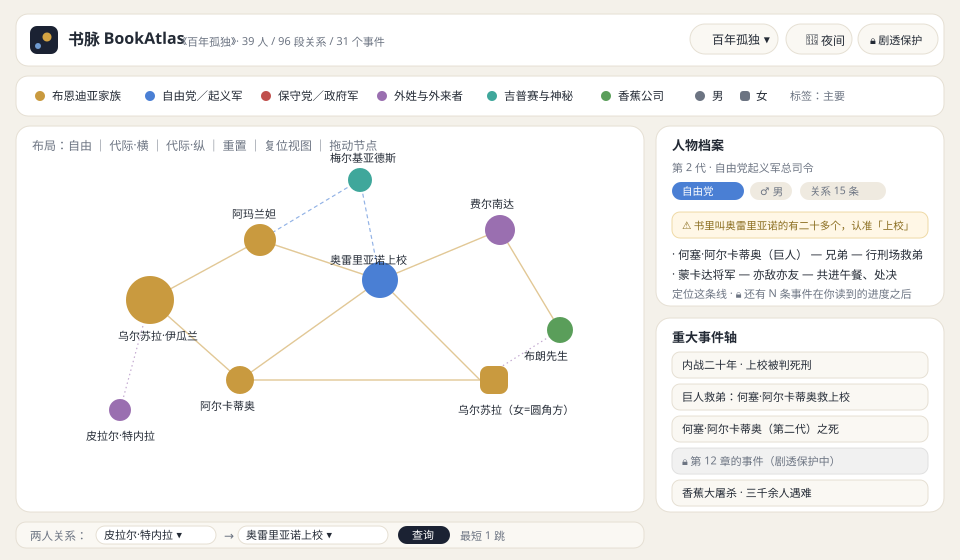
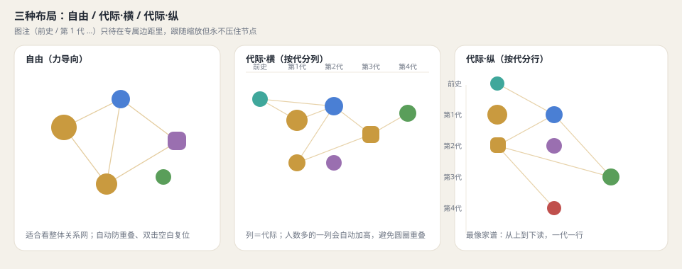
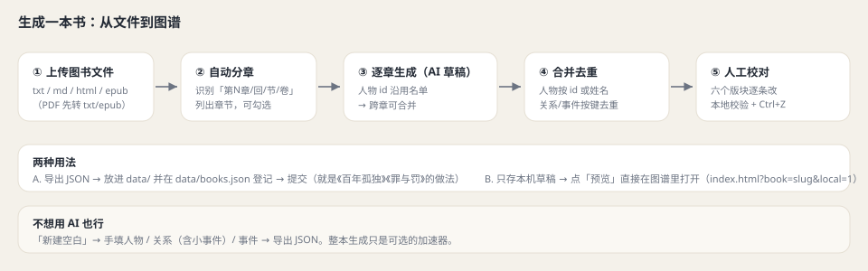

# 书脉 BookAtlas

> 把一本书的**人物关系**、**定义关系的小事件**和**标志性事件**放在一张图上：关系网络 + 重大事件轴 + 「两人关系」最短链 + **剧透保护**；自带**本地编辑器**和**整本生成**流程。
>
> 在线地址：**https://wakennorman.github.io/book-atlas/**
> 代码 MIT · 数据 CC BY-SA 4.0



---

## 能做什么

| 功能 | 说明 |
|---|---|
| **关系网络** | 力导向图；节点按阵营着色、**大小＝关系条数**、**形状＝性别**（● 男 / ▢ 女）；点节点看档案，点连线看关系与依据小事件 |
| **重大事件轴** | 按阶段分组（如"内战二十年"），点事件高亮相关人物；未读事件显示为 🔒 |
| **两人关系** | 本地 **BFS 最短路**，每一跳列出关系类型与依据事件（不依赖 AI、不联网） |
| **三种布局** | 自由 / 代际·横（按代分列）/ 代际·纵（按代分行）；图注有专属边距，跟随缩放但不压节点 |
| **剧透保护** | 按**章节进度**锁定：未读人物=灰色 🔒 且不画关系；未读事件=「🔒 第 N 章的事件」；关系里的小事件、人物结局也按章过滤 |
| **杂项** | 搜索（支持别名，如"上校""索尼娅"）、「定位这条线」、复位视图（双击空白）、深浅色、PWA 离线 |
| **大书怎么读（无限画布）** | 画布可**无限缩放**（2%–4000%）且节点间距随人数自动放大：**放大后名字会越来越多**（像地图分级）；再用「人数：主要/中等」和 **🎯 聚焦（1–2 跳）**把 800+ 人的书拆成一张张小图 |
| **本地编辑器** | 新建/导入、七个版块增删改（含**地点**）、撤销重做（Ctrl+Z / Ctrl+Y）、本地校验、**内嵌实时预览**（左编辑右看图，保存即刷新）、导出 JSON |
| **整本生成** | 上传整本书（**txt / md / html / epub / pdf**）→ 自动分章 → 逐章 AI 草稿（人物 id 沿用名单）→ 一键合并去重；**命令行版** `scripts/wholebook.mjs` 可断点续跑，适合长篇 |

**已收录**

| 书 | 人物 | 关系 | 事件 | 剧透尺度 |
|---|---|---|---|---|
| 《百年孤独》（范晔 译） | 39 | 96 | 31 | 第 1–20 章 |
| 《罪与罚》（汝龙 译） | 24 | 30 | 21 | 41 个顺序章（6 部 + 尾声） |



---

## 快速开始

### 只想看
打开 **https://wakennorman.github.io/book-atlas/** 即可；手机可「添加到主屏幕」离线看。

### 本地跑（不需要联网、不需要 GitHub）
```text
双击  本地预览.bat          # 需要本机有 Python，会自动起服务并打开浏览器
或手动：python -m http.server 8765   # 然后访问 http://localhost:8765/
```
> 直接双击 `index.html` 打不开是正常的：浏览器不允许 `file://` 页面读取数据文件，必须有本地服务。

### 打开编辑器
图谱右上角「✏️ 编辑」，或直接访问 `/editor.html`。
编辑器顶栏的「**预览**」会在右边开一块图谱实时预览（改完点「保存到本地」就会刷新）；「↗」是新标签打开。

---

## 生成一本新书（AI 草稿 → 人工校对）



1. 「新建空白」或「载入」一本现有书（也可以在现有书上改）
2. 进「**整本生成**」，填 API 地址 / Key / 模型（**Key 只存本机浏览器**，不会上传别处）
3. 上传图书文件：支持 **txt / md / html / epub / pdf**（epub 在浏览器内解压解析，PDF 用内置 pdf.js 抽文字层——**都不需要联网、不上传到任何服务器**）——传完会**自动分章**
4. 勾选章节 →「② 逐章生成」（一章约 1–2 分钟，可随时停止）
5. 「③ 合并去重」：人物按 **id 或姓名**合并、关系按 `from|to|类型` 合并并去重小事件、事件按 id 去重
6. 到各版块**逐条校对**（重点：同名人物、关系方向、事件章节），「本地校验」查一遍
7. 「导出 JSON」→ 放进 `data/`，在 `data/books.json` 登记一行 → 提交（也可以只用「预览」在本机看效果）

> 不用 AI 也完全可以：「新建空白」手填人物 / 关系 / 事件，跟做思维导图一样。

### 命令行跑整本（长篇推荐，`scripts/wholebook.mjs`）

浏览器里跑 120 回要一直开着标签页；命令行版把每章结果即时写进 `data/.gen-<slug>.json`，**断了能接着跑**：

```bash
# 先抽 epub 正文，再逐回生成（每回两轮：人物/关系 + 事件，避免输出被截断丢掉事件）
LLM_BASE_URL=https://api.deepseek.com/v1 LLM_API_KEY=sk-xxx LLM_MODEL=deepseek-chat \
  node scripts/wholebook.mjs --epub 三国演义.epub --title 三国演义 --slug three-kingdoms --jobs 3
# 只跑一部分 / 续跑：
node scripts/wholebook.mjs --text book.txt --title X --slug x --only 31-120 --jobs 3
```

- `--jobs N` 并发章数（默认 3）；`--only 1-30,35` 指定回/章号；`--max-tokens` 默认 16000
- 输出前会自动合并去重、丢弃悬空引用（AI 写到没抽出来的人物/地点时）、按 `phases[].from/to` 分阶段
- 跑完记得 `node scripts/validate.mjs data/<slug>.json` 再人工校对

---

## 数据规范

```jsonc
{
  "meta":       { "slug": "", "title": "", "author": "", "chapters": 20, "groupMode": "", "note": "", "license": "CC BY-SA 4.0", "sources": [] },
  "factions":   [{ "key": "", "name": "", "color": "#hex" }],
  "characters": [{ "id": "pinyin-kebab", "name": "", "aliases": [], "generation": 1, "gender": "m|f",
                   "firstCh": 1, "faction": "", "tier": "main|minor|mentioned", "title": "", "desc": "", "fate": "", "note": "" }],
  "relations":  [{ "from": "id", "to": "id", "type": "", "kin": "blood|marriage|inlaw|adoptive|foster|step|sworn（亲属才填）", "style": "solid|dashed|dotted",
                   "events": [{ "text": "定义这段关系的小事件", "chapter": "第X章", "place": "地点 id（可空）" }] }],
  "places":     [{ "id": "pinyin-kebab", "name": "", "aliases": [], "type": "城镇|宅邸|酒馆…", "firstCh": 1, "desc": "" }],
  "phases":     [{ "id": "p1", "name": "", "order": 1 }],
  "events":     [{ "id": "e1", "phase": "p1", "order": 1, "ch": 1, "name": "", "chars": ["id"],
                   "place": "地点 id（可空）", "summary": "", "impact": "", "quote": "" }]
}
```

要点：
- `style`：`solid`＝亲缘/同盟；`dashed`＝对立/伤害；`dotted`＝情人/过去/间接
- **没有明确年份的书不要编年份**，用 `phase + order` 排序
- `relations[].events` 优先收录"看着不起眼、却定义了两人关系"的小事件
- **地点是"筛选器"，不是图上的节点**：`places[]` 是地点清单，`events[].place` / `relations[].events[].place` 把事件挂到地点上。别把地点画进关系图（会变成异构图、边语义混乱）；只有当地点**本身参与推理**（密室、列车时刻、地图动线）时才值得另做「地点页 / 地图视图」
- 不是家族史的书：见下面的「分组标准」

### 分组标准（决定用「代际」还是「阵营」）

**一本书只选一个分组轴**。判据是三条问句——**任意一条为「是」→ 用代际轴**：

1. 有没有「父子 / 母女 / 祖孙」等**跨代血缘关系构成主线**？（家族史诗）
2. 有没有明确的**「上一代 → 下一代」时间跳跃**？（恩怨、复仇、遗产、继承传代）
3. 主要人物是否**跨越几代人的人生阶段**出场，而不是同一代人的人生片段？

三条都为「否」→ 用**阵营轴**：按派别 / 机构 / 关系圈分组（如《罪与罚》：主角与其家人 / 玛尔美拉朵夫一家 / 警察与司法 / 斯维德利盖洛夫与卢仁 / 底层与市井）。

**字段约定（两种模式共用一套 schema）**

| 字段 | 代际轴 | 阵营轴 |
|---|---|---|
| `generation` | 0＝前史，1..N＝第几代 | **一律填 1**（不造假代际） |
| `faction` | 同代内的排序与配色 | **就是分组名** |
| `meta.groupMode` | `"generation"` | `"faction"` |

- 显式声明优先；留空则**自动判定**（代际种类 ≥ 2 → 代际，否则阵营）
- 视图层会自动适配：代际轴显示「代际·横/纵 + 前史/第 N 代」；阵营轴显示「**分组·横/纵 + 阵营名**」，人物卡也不显示"第 N 代"
- `validate.mjs` 会检查声明与数据是否矛盾（例如声明代际却只有 1 种 → 警告），并打印当前分组判定；编辑器「基本信息」里也有同样的**分组诊断**

### 文案写作规范（`validate.mjs` 会自动检查）

1. **先写全名**，外号/称呼写进括号：`何塞·阿尔卡蒂奥（第二代，绰号「巨人」）`
2. **一句一个主语**，不用「他／她」跨句指代不同人
3. **亲属称谓必须配人名**：写"父亲何塞·阿尔卡蒂奥"，不要只写"父亲"
4. 关系文案出现的人必须与 `relations[].from/to` 一致；事件文案提到的人必须出现在 `events[].chars`
5. 事件文案要能**脱离上下文读懂**（谁 · 对谁 · 做了什么 · 后果）

### 亲属关系规范（`relations[].kin`）——「是不是亲生的」必须一眼看出

**为什么**：同一张图里既有亲生的母子，也有收养的母女、继母女、被谁带大的孩子、姻亲……
如果全都写成「母子」「姐妹」，读者没法判断这条线是不是血缘（《百年孤独》里乌尔苏拉↔「巨人」是**亲母子**，乌尔苏拉↔丽贝卡是**收养**，阿尔卡蒂奥是**祖孙但由乌尔苏拉带大**）。

**值（七类，缺一不可混）**

| kin | 含义 | 例 |
|---|---|---|
| `blood` | 血缘（亲生；含祖孙、叔侄、堂表、孪生） | 乌尔苏拉↔「巨人」亲母子；乌尔苏拉↔阿尔卡蒂奥祖孙 |
| `marriage` | 婚姻（夫妻、妾室） | 老何塞↔乌尔苏拉（表兄妹成婚） |
| `inlaw` | 姻亲（配偶方亲属：岳父、公婆、儿媳、女婿、嫂、姐夫、妯娌、亲家） | 费尔南达↔乌尔苏拉：婆媳 |
| `adoptive` | **正式收养**（养父母/养子女） | 乌尔苏拉↔丽贝卡：养母女 |
| `foster` | **非正式**：被谁带大、寄养、乳母养大（不改变血缘事实） | 乌尔苏拉把孙子阿尔卡蒂奥带大 |
| `step` | 继亲（继父母/继子女） | 《罪与罚》卡捷琳娜↔索尼雅：继母女 |
| `sworn` | 结义干亲（结拜兄弟、干爹干娘、教父教子） | 刘关张桃园结义 |

**三条硬规则（`validate.mjs` 会查）**

1. **是家人就得标 `kin`**；不是家人（朋友、仇敌、君臣、情人）**不要**标
2. **关系名（`type`）的措辞必须与 `kin` 一致**：收养的写「养母女」，绝不写「母女」；继亲写「继母女」；结义写「结义兄弟」；拿不准的关系宁可写「收养的家人（辈分乱）」这种含糊说法，也不要冒充血缘
3. 血缘称谓（父子/母女/兄弟/祖孙…）只能配 `blood`；写了血缘称谓又标 `adoptive/foster/step/sworn` ⇒ **报错**

**工具**：`node scripts/annotate-kin.mjs [--write]` 会按关系名**猜** kin 并报告猜不出的（人工复核后再写回）；图上面板与关系链会显示「血缘/收养/继亲/姻亲/结义」徽章。

### 剧透保护（书里带这三个字段就能用）

- `meta.chapters`（总章数）、`characters[].firstCh`（首次出场章）、`events[].ch`（发生章）
- 关系/小事件的解锁章号 = 该关系 `events[].chapter` 里的**最小章号**；人物「结局」按**最后出场章**（出场章 + 相关事件章的最大值）判断
- 首发进入会**强制二选一**：不介意剧透（全部解锁）/ 我在读（选读到第几章）；右上角随时可改，进度按书存在本机

### 地点维度（第三维度，`editor.html` 里能直接编）

- 地点**不吃关系图的节点**，只做三件事：📍**地点筛选**（时间轴只剩该地点的事件、图上只亮相关人物）、**地点面板**（这是哪类地方 + 发生过什么）、事件卡上的 📍 小标可点
- 地点也吃**剧透保护**：`places[].firstCh` 没到就不出现在下拉里
- **筛选必须全局生效**：一旦按地点筛选，点人物也只在「该地点范围内」展开（范围＝该地点事件涉及的人 ∪ 该地点关系事件的两端）；点到范围外的人会**自动取消筛选**，而不是偷偷把全部关系放出来
- 因此**关系里的小事件也要标 `place`**（`relations[].events[].place`）——只标有把握的，宁缺勿错；没标的不会出现在任何地点筛选结果里

---

## 脚本

> 需要 Node 18+；本机 Node 不在 PATH 时，用绝对路径，例如
> `& "C:\Users\chw\.cache\codex-runtimes\codex-primary-runtime\dependencies\node\bin\node.exe" scripts\validate.mjs`

| 脚本 | 用途 |
|---|---|
| `scripts/validate.mjs` | 数据校验 + 文案规范检查 + `gender/firstCh/ch` + 地点引用 + 亲属关系（kin）检查。`node scripts/validate.mjs --all` 一把过 |
| `scripts/annotate-kin.mjs` | 按关系名猜 `kin`（血缘/收养/继亲/姻亲/结义…）并报告猜不出的：`node scripts/annotate-kin.mjs [--write]` |
| `scripts/assign-phases.mjs` | 按 `phases[].from/to` 的章区间把事件归到阶段（逐章生成只有第 1 章输出 phase）：`node scripts/assign-phases.mjs data/xx.json [--write]` |
| `scripts/wholebook.mjs` | **整本生成（命令行版）**：逐章抽取 → 合并去重 → 写出数据；可 `--jobs` 并发、可断点续跑 |
| `scripts/dedupe-chars.mjs` | 同名/别名人物合并（整本生成后必跑一遍）：`node scripts/dedupe-chars.mjs data/xx.json [--write]` |
| `scripts/draft.mjs` | 一次性 AI 草稿：`node scripts/draft.mjs --title "书名" [--text book.txt]` |
| `scripts/extract-epub.mjs` | 零依赖 EPUB 抽文（本地校对用）：`node scripts/extract-epub.mjs book.epub out.txt [--split 目录]` |
| `tools/local-sink.mjs` | 本地小接收器：编辑器「导出 JSON」直接写进 `data/`（无头浏览器里下载会落到别处）：`node tools/local-sink.mjs` |
| `tools/push-via-api.ps1` | GitHub API 发布（本机 `git push` 被墙时用），自动遵守 `.gitignore`，同时开/查 Pages |

---

## 目录结构

```
book-atlas/
├── index.html / css/style.css / js/app.js      # 图谱应用（ECharts）
├── editor.html / css/editor.css / js/editor.js  # 本地编辑器（含内嵌实时预览）
├── data/books.json                              # 书目清单
├── data/<slug>.json                             # 每本书的数据
├── vendor/                                      # echarts、fflate、pdf.js（离线可用）
├── scripts/                                     # validate / kin / annotate-kin / assign-phases / wholebook / draft / extract-epub
├── tools/push-via-api.ps1                       # 发布脚本
├── tools/local-sink.mjs                         # 本地接收器（把编辑器导出写进 data/）
├── docs/                                        # 方案评估、示意图、预览页
└── sw.js / manifest.webmanifest                 # PWA 离线
```

---

## 部署与发布

- 部署：GitHub 仓库 → Settings → Pages → `main` / `/ (root)`
- 发布：改完数据后跑 `tools\push-via-api.ps1`（从 Git 凭据管理器取 token，走 GitHub API 建 blob/tree/commit，再更新分支）
- **改前端资源后要同步两处**：`sw.js` 里的 `CACHE = 'bookatlas-vNN'` 版本号，以及 `editor.html` 里资源引用的 `?v=NN`（并把带版本号的 URL 加进 SW 的预缓存清单），否则老访客会一直看到旧代码

---

## 常见问题

**双击 `index.html` 空白/报错？** 数据是 `fetch` 读的，需要本地服务：用 `本地预览.bat` 或 `python -m http.server`。

**PDF 上传没反应 / 提示"没有文字层"？** 浏览器端用内置 pdf.js 抽**文字层**；如果这本 PDF 是**扫描件（图片版）**，谁都抽不出字来——先用 OCR（如 ABBYY、微信读书/稻壳等）或 Calibre 转成带文字层的 epub/txt。另外超大 PDF（几百页）解析要等几秒，页面会显示进度。

**AI 报 CORS / 失败？** 浏览器直连需要端点允许跨域（DeepSeek 官方可以）；不行就用命令行 `draft.mjs`。Key 只存本机，永远不会上传到本项目。

**改了代码/数据没生效？** 是 Service Worker 缓存：刷新一次；改代码时记得按上面"两处版本号"同步。

**会不会剧透？** 开「剧透保护」并选好进度；也可以先把「标签」切成"主要"减少信息量。

**人物太多、密密麻麻看不清？**（比如《三国演义》871 人）三招，从大到小：
1. **人数过滤**（右上「人数」）：先切「主要（前 60）」或「中等（前 200）」；
2. **🎯 聚焦**：点任意人物 → 面板里点「🎯 1 跳」只看他的直接关系网（「＋跳」可扩到 2 跳），顶部会出现「看全部」退出；
3. **直接放大**：画布是无限制的（2%–4000%），**放得越大名字露得越多**；双击空白＝复位视图。
> 节点拖不动是正常的（默认关，避免和画布平移打架）：需要微调时点「拖动节点：开」。

---

## 版权与致谢

- 原著文本与书名版权归各自权利人所有；本仓库只收录**阅读辅助数据**（人物、关系、事件的结构化整理），不收录原文正文
- 《百年孤独》家族树参考：Wikimedia Commons（作者 Michel Bakni，CC BY-SA 4.0）
- 图表库 [Apache ECharts](https://echarts.apache.org/)（Apache-2.0）、EPUB 解压 [fflate](https://github.com/101arrowz/fflate)（MIT）、PDF 抽取 [pdf.js](https://mozilla.github.io/pdf.js/)（Apache-2.0）
- 思路参考 [story-graph](https://github.com/Drwei3155/story-graph)（MIT）——本项目数据不依赖 AI 生成，AI 只当草稿工具
