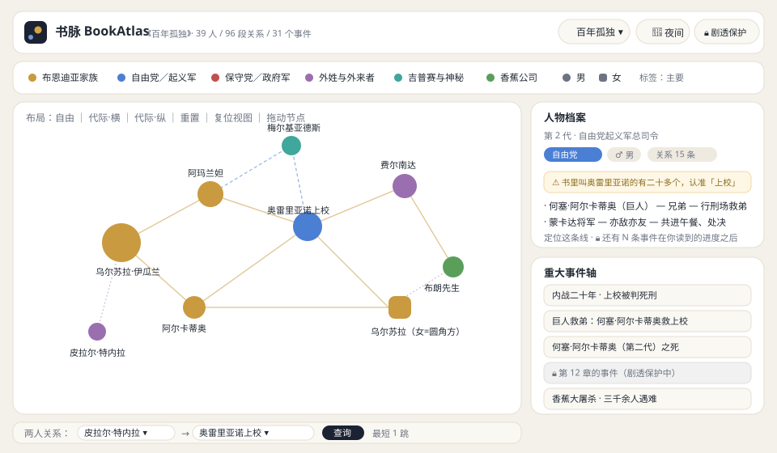
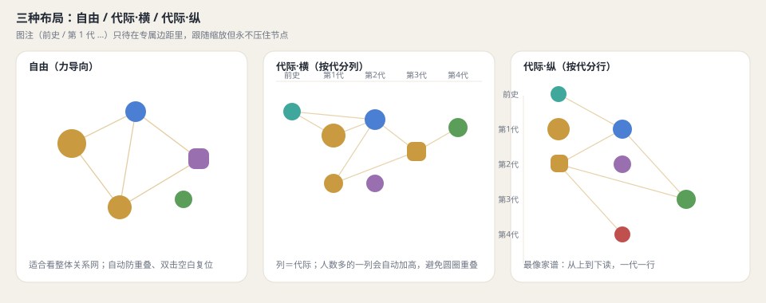
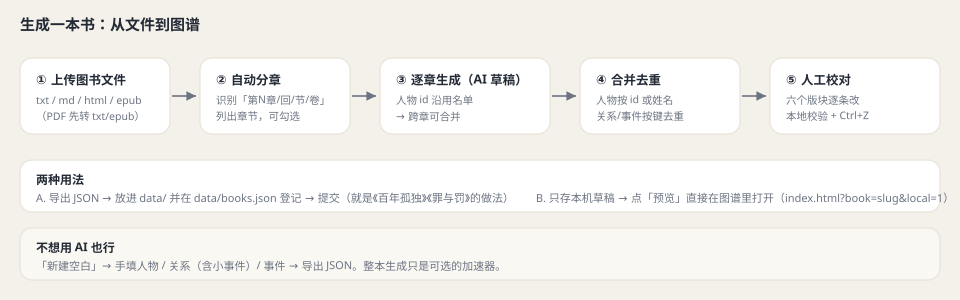

# 书脉 BookAtlas

> 把一本书的**人物关系**、**定义关系的小事件**和**标志性事件**放在一张图上：关系网络 + 重大事件轴 + 「两人关系」最短链 + **剧透保护**；自带**本地编辑器**和**整本生成**流程。
>
> 在线地址：**https://wakennorman.github.io/book-atlas/**
> 代码 MIT · 数据 CC BY-SA 4.0 · 更新记录见 [CHANGELOG.md](CHANGELOG.md)



---

## 能做什么

| 功能 | 说明 |
|---|---|
| **关系网络** | 力导向图；节点按阵营着色、**大小＝关系条数**、**形状＝性别**（● 男 / ▢ 女）；点节点看档案，点连线看关系与依据小事件 |
| **重大事件轴** | 按阶段分组（如"内战二十年"），点事件高亮相关人物；未读事件显示为 🔒 |
| **两人关系** | 本地 **BFS 最短路**，每一跳列出关系类型与依据事件（不依赖 AI、不联网） |
| **三种布局** | 自由 / 代际·横（按代分列）/ 代际·纵（按代分行）；图注有专属边距，跟随缩放但不压节点 |
| **剧透保护** | 按**章节进度**锁定：未读人物=灰色 🔒 且不画关系；未读事件=「🔒 第 N 章的事件」；关系里的小事件、人物结局也按章过滤 |
| **章节视图** | 右侧「📖 第 N 章」：本章**谁初次登场**、新增哪些关系、发生什么事件、在哪儿发生；一键「我读到这一章了」推进进度，并提示**下一章将解锁什么**（只报数量不点名） |
| **时间旅行（时间滑块）** | 章节面板里的「🕰 时间旅行」+ 滑块：把**图谱**拨回第 N 章——只画**当时已经发生**的关系；同盟→反目这类**阶段关系**（`relations[].fromCh/toCh`）会随时间切换（三国：曹操↔袁绍 同盟→貌合神离→敌对→旧交）。不改变你的真实阅读进度；剧透保护开着时最多拨到"读到的那一章" |
| **关系过滤** | 工具栏「关系：全部」：按亲缘（血缘 / 婚姻·姻亲 / 收养·抚养·继亲 / 结义 / 无亲缘标注）与线条（实线 / 虚线 / 点线）过滤；快捷键「**只看亲缘**」（当家族树用）、「**只看对立·伤害**」；底部「两人关系」与导出也跟着过滤，人数提示里带「关系 N / M」 |
| **人物志 · 人物卡** | 点人物＝档案 + 按章排的「**他的一生**」（事件 · 地点 · 原文引文）+ 关系列表；「**🖼 人物卡**」把这个人导成 PNG（身份、结局、关键关系与依据事件），吃剧透保护 |
| **导出 / 分享** | 右上「⬇️ 导出」五种：**单文件 HTML**（一本书连图带数据打包成一个文件，别人双击就能看，不用服务器/不用联网）· **分享图 PNG** · **打印版 SVG**（A3 矢量，标签自动避让，可打印或另存 PDF）· **阅读伴侣 EPUB**（传进微信读书）· 数据 JSON。导出跟随当前筛选与剧透进度 |
| **AI 讲解（不剧透）** | 跑完「两人关系」或点开某个人，面板里可让 AI「讲一遍」：**资料先在本地按进度过滤**（结局、未解锁的关系与事件都不发出去），提示词也钉死"只讲第 N 章之前"；不传原著正文，Key 只存本机（与编辑器共用） |
| **数据体检** | 编辑器「🩺 体检」：结构 / 引用 / 亲属 / 别名 / 时间区间一次过（错误·警告·提示 + 别名覆盖率 + 时间区间数）；每条都能「**去改**」直接跳到那条；可「复制报告」；「🪄 一键补齐译名变体」；附「贡献给项目」三步清单 |
| **外部深链** | 书名旁边直接给「**微信读书 / 豆瓣 / 维基百科**」链接（在 `data/books.json` 的 `links` 里配，可以自己加）；页面标题会跟着书变（《百年孤独》· 书脉 BookAtlas），分享到微信/微博用 `assets/og-cover.jpg` 当缩略图 |
| **无障碍** | 「♿ 显示」：**色盲友好配色**（Okabe–Ito 八色，按阵营顺序分配；图、图例、分享图、打印版、人物卡全都跟随）+ **字号**（小 / 中 / 大，同时影响图上名字与面板文字）。**键盘**：Tab 聚焦到图上后，方向键在人物间移动（视图跟着走）、回车看档案、Esc 取消；图未聚焦时方向键仍是翻章。**读屏**：图带 `role="img"` 与动态 `aria-label`（显示人数 / 时间旅行 / 剧透进度 / 当前选中），移动时用 live region 播报「谁、几条关系、第几章出场」 |
| **杂项** | 搜索（支持别名，如"上校""索尼娅"）、「定位这条线」、复位视图（双击空白）、深浅色、PWA 离线、**📖 怎么用**（右上角使用说明，每条都能在图上直接演示一遍） |
| **大书怎么读（无限画布）** | 画布可**无限缩放**（2%–4000%）且节点间距随人数自动放大：**放大后名字会越来越多**（像地图分级）；再加上「**次要人物**默认收起」（《三国演义》326/871 人）+「人数：主要/中等」+ **🎯 聚焦（1–2 跳）**，把 800+ 人的书拆成一张张小图 |
| **本地编辑器** | 新建/导入、七个版块增删改（含**地点**）、撤销重做（Ctrl+Z / Ctrl+Y）、本地校验、**内嵌实时预览**（左编辑右看图，保存即刷新）、导出 JSON |
| **整本生成** | 上传整本书（**txt / md / html / epub / pdf**）→ 自动分章 → 逐章 AI 草稿（人物 id 沿用名单）→ 一键合并去重；**命令行版** `scripts/wholebook.mjs` 可断点续跑，适合长篇 |

**已收录**

| 书 | 人物 | 关系 | 事件 | 剧透尺度 |
|---|---|---|---|---|
| 《百年孤独》（范晔 译） | 39 | 96 | 31 | 第 1–20 章 |
| 《罪与罚》（汝龙 译） | 24 | 30 | 21 | 41 个顺序章（6 部 + 尾声） |



---

## 快速开始

### 只想看
打开 **https://wakennorman.github.io/book-atlas/** 即可；手机可「添加到主屏幕」离线看。
第一次用先点右上角 **「📖 怎么用」**：里面 13 条说明各配一张示意图，点「试一下」会**拿这本书在图上真做一遍**给你看（搜索、聚焦、看清 1:1、地点筛选、关系过滤、人物志与人物卡、两人关系链…）。

### 本地跑（不需要联网、不需要 GitHub）
```text
双击  本地预览.bat          # 需要本机有 Python，会自动起服务并打开浏览器
或手动：python -m http.server 8765   # 然后访问 http://localhost:8765/
```
> 直接双击 `index.html` 打不开是正常的：浏览器不允许 `file://` 页面读取数据文件，必须有本地服务。

### 打开编辑器
图谱右上角「✏️ 编辑」，或直接访问 `/editor.html`。
编辑器顶栏的「**预览**」会在右边开一块图谱实时预览（改完点「保存到本地」就会刷新）；「↗」是新标签打开。

### 导出与分享（图谱右上「⬇️ 导出」）

- **单文件 HTML**：把当前这本书（图谱 + 全部数据 + 章节视图 + 使用说明）打包成一个 `.html`。发给别人**双击就能看**：不用服务器、不用联网（图表库已内联）；单文件版自动隐藏编辑器和导出入口。
- **分享图 PNG**：书名、统计、图例 + 关系图，适合发想法 / 圈子 / 朋友圈。
- **打印版 SVG（A3 横向）**：矢量图，标签自动避让、按"右→左→上→下"找空位；用浏览器打开后「打印 → 另存为 PDF」，或直接进排版软件。
- **数据 JSON**：这本书的原始数据，方便手工改，或拖进编辑器继续整理。
- **阅读伴侣 EPUB**：关系总图 + 人物志（按出场章）+ 事件轴做成一本小册子——**不含原著正文**，用微信读书「传书到手机」/文件传输助手导入后与原著并排读。它**跟随你当前的剧透进度**（锁着的人与事件不写进去），读到后面再导出一次即可。
- **人物卡 PNG**（不在导出面板里）：点任意人物 → 面板「🖼 人物卡」，单独导出这个人的卡片（身份、结局、关键关系与依据事件）。

> 导出内容**跟随你当前的筛选**：剧透进度、人数、次要人物、地点、聚焦都会生效（分享图与打印版用矢量重绘，不受你当前缩放影响）。

### 微信小程序（国内访问）

`miniprogram/` 是一份**微信小程序**（图谱 + 搜索 + 两人关系 + 关系过滤 + 章节视图 + 剧透保护 + 时间旅行），
数据全部打包在本地——**不联网、不需要服务器、不需要备案域名**；因为个人主体小程序不能用 `web-view`，渲染层是重写的。

- **分享卡片**：一键生成 1200×900 的关系图分享图（保存相册 / 发送给好友），转发与朋友圈也会带上它
- 数据是构建产物：`node scripts/make-miniprogram-packs.mjs` 从 `data/*.json` 生成 `miniprogram/data/*.js`
  （**坐标预计算**：分组·纵/横是确定性的，自由布局在 Node 里跑简化力导向，小程序端零布局开销）
- 逻辑与绘制是纯函数（`miniprogram/utils/graph.js` / `render.js`），口径与网页版一致；`node miniprogram/test/smoke.mjs` 可在**没有开发者工具**的情况下跑通页面逻辑
- 上手步骤、**备案与类目注意事项**（20 日内备案 / 选工具类 / 名称别碰"微信读书"）见 `miniprogram/README.md`

### AI 讲解（不剧透）

跑完「两人关系」或点开某个人 → 面板底部「**🤖 讲一遍（不剧透）**」：

- **资料先在本地按进度过滤**：只发送你已经读到的关系、依据事件与档案；结局（`fate`）在进度之后时**根本不发**，关系时段也会裁掉未来（读到第 25 章时只写「第 12 章起」，不告诉你到第几章结束）
- 提示词里钉死：只能使用给出的资料、只描述第 N 章及之前、不许用"后来 / 最终 / 结局"这类预示
- **不上传原著正文**；API Key 只存本机（`ba-ai-key`，与编辑器共用同一份配置）
- 时间旅行开着时，上限取"阅读进度"与"时间指针"里更小的那个
- 端点默认 DeepSeek（浏览器可直连）；换端点若报 CORS，用编辑器里的命令行方式

---

## 生成一本新书（AI 草稿 → 人工校对）



1. 「新建空白」或「载入」一本现有书（也可以在现有书上改）
2. 进「**整本生成**」，填 API 地址 / Key / 模型（**Key 只存本机浏览器**，不会上传别处）
3. 上传图书文件：支持 **txt / md / html / epub / pdf**（epub 在浏览器内解压解析，PDF 用内置 pdf.js 抽文字层——**都不需要联网、不上传到任何服务器**）——传完会**自动分章**
4. 勾选章节 →「② 逐章生成」（一章约 1–2 分钟，可随时停止）
5. 「③ 合并去重」：人物按 **id 或姓名**合并、关系按 `from|to|类型` 合并并去重小事件、事件按 id 去重
6. 到各版块**逐条校对**（重点：同名人物、关系方向、事件章节），「本地校验」查一遍
7. 「导出 JSON」→ 放进 `data/`，在 `data/books.json` 登记一行 → 提交（也可以只用「预览」在本机看效果）

> 不用 AI 也完全可以：「新建空白」手填人物 / 关系 / 事件，跟做思维导图一样。

### 发布前自检与贡献（🩺 体检）

编辑器导航里的「**🩺 体检**」把发布前该查的都过一遍：结构 / 引用完整性 / 亲属关系（kin 与关系名是否矛盾）/ 别名覆盖 / 译名变体 / 亲子成环 / 时间区间。结果分**错误 · 警告 · 提示**三档，每条都能点「**去改**」直接跳到那条记录；「📋 复制报告」可把整份报告贴到 Issue 里。

给项目加一本新书（三步）：

1. 先把「错误」清零 → 点顶栏「**导出 JSON**」
2. 命令行再跑一遍：`node scripts/validate.mjs data/<slug>.json` 与 `node scripts/audit-search.mjs --all`（命令行比网页多几项高噪音的文案 lint）
3. 把 JSON 放进 `data/`、在 `data/books.json` 登记一行，然后提 Issue / PR —— 写清**这本书的来源**（哪个译本 / 哪个电子版）与**校对方式**

### 命令行跑整本（长篇推荐，`scripts/wholebook.mjs`）

浏览器里跑 120 回要一直开着标签页；命令行版把每章结果即时写进 `data/.gen-<slug>.json`，**断了能接着跑**：

```bash
# 先抽 epub 正文，再逐回生成（每回两轮：人物/关系 + 事件，避免输出被截断丢掉事件）
LLM_BASE_URL=https://api.deepseek.com/v1 LLM_API_KEY=sk-xxx LLM_MODEL=deepseek-chat \
  node scripts/wholebook.mjs --epub 三国演义.epub --title 三国演义 --slug three-kingdoms --jobs 3
# 只跑一部分 / 续跑：
node scripts/wholebook.mjs --text book.txt --title X --slug x --only 31-120 --jobs 3
```

- `--jobs N` 并发章数（默认 3）；`--only 1-30,35` 指定回/章号；`--max-tokens` 默认 16000
- 输出前会自动合并去重、丢弃悬空引用（AI 写到没抽出来的人物/地点时）、按 `phases[].from/to` 分阶段
- 跑完记得 `node scripts/validate.mjs data/<slug>.json` 再人工校对

---

## 数据规范

```jsonc
{
  "meta":       { "slug": "", "title": "", "author": "", "chapters": 20, "schemaVersion": 2, "groupMode": "", "note": "", "license": "CC BY-SA 4.0", "sources": [] },
  "factions":   [{ "key": "", "name": "", "color": "#hex" }],
  "characters": [{ "id": "pinyin-kebab", "name": "", "aliases": [], "generation": 1, "gender": "m|f",
                   "firstCh": 1, "faction": "", "tier": "main|minor|mentioned", "title": "", "desc": "", "fate": "", "note": "" }],
  "relations":  [{ "from": "id", "to": "id", "type": "", "kin": "blood|marriage|inlaw|adoptive|foster|step|sworn（亲属才填）", "style": "solid|dashed|dotted",
                   "fromCh": 0, "toCh": 0, "events": [{ "text": "定义这段关系的小事件", "chapter": "第X章", "place": "地点 id（可空）" }] }],
  "places":     [{ "id": "pinyin-kebab", "name": "", "aliases": [], "type": "城镇|宅邸|酒馆…", "firstCh": 1, "desc": "" }],
  "phases":     [{ "id": "p1", "name": "", "order": 1 }],
  "events":     [{ "id": "e1", "phase": "p1", "order": 1, "ch": 1, "name": "", "chars": ["id"],
                   "place": "地点 id（可空）", "summary": "", "impact": "", "quote": "" }]
}
```

要点：
- `data/books.json` 里每本书可以带 `links: [{ label, url }]` —— 图谱页书名旁会显示（已配：微信读书 / 豆瓣 / 维基百科）；没有链接的书不受影响
- `style`：`solid`＝亲缘/同盟；`dashed`＝对立/伤害；`dotted`＝情人/过去/间接
- **`fromCh` / `toCh`（可选）＝关系的时间区间**（`toCh` 独占：第 `toCh` 章起不再存在）：同一对人如果关系变了（同盟→反目、主从→仇敌），**拆成多条**并各给区间——「时间旅行」会按章只画当时那一段；同一条关系的多条依据事件不用拆（写同一条里即可）。`node scripts/_patch-relation-periods.mjs` 可以按"关系名+线型"自动分段（干跑默认，`--write` 落盘）
- **没有明确年份的书不要编年份**，用 `phase + order` 排序
- `relations[].events` 优先收录"看着不起眼、却定义了两人关系"的小事件
- **地点是"筛选器"，不是图上的节点**：`places[]` 是地点清单，`events[].place` / `relations[].events[].place` 把事件挂到地点上。别把地点画进关系图（会变成异构图、边语义混乱）；只有当地点**本身参与推理**（密室、列车时刻、地图动线）时才值得另做「地点页 / 地图视图」
- **`tier` 三档**（大书必用）：`main` 正常显示；`minor`＝只跟一两个人有关系的次要人物，**图上默认收起**（工具栏可展开，搜索会自动展开并定位）；`mentioned`＝没出场、只有关系，同样默认收起。用 `node scripts/prune.mjs data/xx.json --write --demote 2` 可批量把关系数 ≤2 的人标成 `minor`
- 不是家族史的书：见下面的「分组标准」

### 分组标准（决定用「代际」还是「阵营」）

**一本书只选一个分组轴**。判据是三条问句——**任意一条为「是」→ 用代际轴**：

1. 有没有「父子 / 母女 / 祖孙」等**跨代血缘关系构成主线**？（家族史诗）
2. 有没有明确的**「上一代 → 下一代」时间跳跃**？（恩怨、复仇、遗产、继承传代）
3. 主要人物是否**跨越几代人的人生阶段**出场，而不是同一代人的人生片段？

三条都为「否」→ 用**阵营轴**：按派别 / 机构 / 关系圈分组（如《罪与罚》：主角与其家人 / 玛尔美拉朵夫一家 / 警察与司法 / 斯维德利盖洛夫与卢仁 / 底层与市井）。

**字段约定（两种模式共用一套 schema）**

| 字段 | 代际轴 | 阵营轴 |
|---|---|---|
| `generation` | 0＝前史，1..N＝第几代 | **一律填 1**（不造假代际） |
| `faction` | 同代内的排序与配色 | **就是分组名** |
| `meta.groupMode` | `"generation"` | `"faction"` |

- 显式声明优先；留空则**自动判定**（代际种类 ≥ 2 → 代际，否则阵营）
- 视图层会自动适配：代际轴显示「代际·横/纵 + 前史/第 N 代」；阵营轴显示「**分组·横/纵 + 阵营名**」，人物卡也不显示"第 N 代"
- `validate.mjs` 会检查声明与数据是否矛盾（例如声明代际却只有 1 种 → 警告），并打印当前分组判定；编辑器「基本信息」里也有同样的**分组诊断**

### 文案写作规范（`validate.mjs` 会自动检查）

1. **先写全名**，外号/称呼写进括号：`何塞·阿尔卡蒂奥（第二代，绰号「巨人」）`
2. **一句一个主语**，不用「他／她」跨句指代不同人
3. **亲属称谓必须配人名**：写"父亲何塞·阿尔卡蒂奥"，不要只写"父亲"
4. 关系文案出现的人必须与 `relations[].from/to` 一致；事件文案提到的人必须出现在 `events[].chars`
5. 事件文案要能**脱离上下文读懂**（谁 · 对谁 · 做了什么 · 后果）

### 亲属关系规范（`relations[].kin`）——「是不是亲生的」必须一眼看出

**为什么**：同一张图里既有亲生的母子，也有收养的母女、继母女、被谁带大的孩子、姻亲……
如果全都写成「母子」「姐妹」，读者没法判断这条线是不是血缘（《百年孤独》里乌尔苏拉↔「巨人」是**亲母子**，乌尔苏拉↔丽贝卡是**收养**，阿尔卡蒂奥是**祖孙但由乌尔苏拉带大**）。

**值（七类，缺一不可混）**

| kin | 含义 | 例 |
|---|---|---|
| `blood` | 血缘（亲生；含祖孙、叔侄、堂表、孪生） | 乌尔苏拉↔「巨人」亲母子；乌尔苏拉↔阿尔卡蒂奥祖孙 |
| `marriage` | 婚姻（夫妻、妾室） | 老何塞↔乌尔苏拉（表兄妹成婚） |
| `inlaw` | 姻亲（配偶方亲属：岳父、公婆、儿媳、女婿、嫂、姐夫、妯娌、亲家） | 费尔南达↔乌尔苏拉：婆媳 |
| `adoptive` | **正式收养**（养父母/养子女） | 乌尔苏拉↔丽贝卡：养母女 |
| `foster` | **非正式**：被谁带大、寄养、乳母养大（不改变血缘事实） | 乌尔苏拉把孙子阿尔卡蒂奥带大 |
| `step` | 继亲（继父母/继子女） | 《罪与罚》卡捷琳娜↔索尼雅：继母女 |
| `sworn` | 结义干亲（结拜兄弟、干爹干娘、教父教子） | 刘关张桃园结义 |

**三条硬规则（`validate.mjs` 会查）**

1. **是家人就得标 `kin`**；不是家人（朋友、仇敌、君臣、情人）**不要**标
2. **关系名（`type`）的措辞必须与 `kin` 一致**：收养的写「养母女」，绝不写「母女」；继亲写「继母女」；结义写「结义兄弟」；拿不准的关系宁可写「收养的家人（辈分乱）」这种含糊说法，也不要冒充血缘
3. 血缘称谓（父子/母女/兄弟/祖孙…）只能配 `blood`；写了血缘称谓又标 `adoptive/foster/step/sworn` ⇒ **报错**

**工具**：`node scripts/annotate-kin.mjs [--write]` 会按关系名**猜** kin 并报告猜不出的（人工复核后再写回）；图上面板与关系链会显示「血缘/收养/继亲/姻亲/结义」徽章。

### 族谱补全（`derived: true` 的推导关系）—— 祖辈不许断线

**为什么**：一本书里通常只记录了"父母—子女"的直接互动，祖父母和孙辈往往没有对手戏 ⇒ 图上出现「老何塞连不到孙辈」这种断线（《百年孤独》实测）。

**做法**：`node scripts/derive-kin.mjs data/xx.json --write` 从亲子边推导出：

| 推导 | 条件 | 例（百年孤独） |
|---|---|---|
| `祖孙（推导）` | 2 代链（A→B→C） | 老何塞 → 阿尔卡蒂奥 |
| `曾祖孙（推导）` | 3 代链 | 老何塞 → 何塞·阿尔卡蒂奥第二 |
| `伯叔侄/姑侄/舅甥/姨甥（推导）` | 父母的手足（**同一对父母的两个孩子**） | 阿玛兰妲 → 奥雷里亚诺第二 |

- 每条推导边的"依据事件"里写着**推导链**（例：由「老何塞 —父子→ 巨人」「巨人 —父子→ 阿尔卡蒂奥」推导），不是编造
- 图上画成**虚线 + 淡色**，面板/提示里带「推导」徽章；工具栏「族谱补全：显示/隐藏」可整层关掉
- 同名不同人（两个马忠、两个何塞·阿尔卡蒂奥）和自环一律不推导

**方向必须先修对**（`node scripts/fix-parent-cycles.mjs --all [--write]`）：AI 生成的数据里亲子方向会写反（互反双写 / 单向写反两种），脚本按人工核对表修正 + 亲子环检测；**别用统计判据**（"孩子多的人像父母"会把曹操当成曹嵩的爹，"父母先出场"会把伏完和女儿判反）。

### 别名 · 译名 · 搜索命中率（`aliases` 的用法）

**为什么**：读者不会照着数据的全名搜——他们搜「字／号／俗称／小名／自己那版的译名」。`aliases` 漏一个叫法，就等于那个人搜不到（实测：用户按「比西塔西翁」搜《百年孤独》里的维希塔香，搜不到）。

**规则**

1. `aliases` 收**全名以外的一切叫法**：字号（孔明/卧龙、玄德、仲谋）、俗称（美髯公、小霸王、常胜将军）、小名（阿瞒、梅梅、罗佳）、**其他译本的写法**（奥雷良诺/乌苏拉/雷贝卡/墨尔基阿德斯/拉斯科利尼科夫/马尔梅拉多夫…）
2. **只加确定的**：拿不准的字宁可留空（`annotate` 式的猜法不适用于人名）
3. 主要人物（关系数多、读者最可能搜的）**必须有别名**；次要人物尽力而为
4. 每本书整理完**必跑** `node scripts/audit-search.mjs --all`，四条检查：
   - ① 有关系的"主要人物"却没别名 → 补字号/俗称/译名
   - ② 译名变体缺失（内置音译差异表，`--write` 可自动补：奥雷里亚诺↔奥雷良诺、普鲁邓希奥↔普鲁登西奥…）
   - ③ 全书文案里"姓氏+名"的候选但书里没这个人 → **疑似漏人**，人工确认后补人物
   - ④ 去掉括号后同名 → 可能是同一人被拆成两条，也可能是真重名（两个马忠）
5. `validate.mjs` 会替你把关：**有关系却没别名**的人物会告警（≥8 条关系阈值），亲子成环也会告警

> 译名对照（已做进数据）：范晔版 ↔ 黄锦炎/高长荣版（维希塔香/比西塔西翁、乌尔苏拉/乌苏拉、梅尔基亚德斯/墨尔基阿德斯、阿玛兰妲/阿玛兰塔、费尔南达/菲南达、皮拉尔·特内拉/皮拉·苔列娜…）；汝龙版 ↔ 朱海观/王汶版（拉斯柯尔尼科夫/拉斯科利尼科夫、索尼雅/索尼娅、杜尼雅/杜尼娅、玛尔美拉朵夫/马尔梅拉多夫…）；《三国演义》按**字**（孔明、云长、翼德、孟德、仲谋、公瑾、士载、伯约…）。

### 剧透保护（书里带这三个字段就能用）

- `meta.chapters`（总章数）、`characters[].firstCh`（首次出场章）、`events[].ch`（发生章）
- 关系/小事件的解锁章号 = 该关系 `events[].chapter` 里的**最小章号**；人物「结局」按**最后出场章**（出场章 + 相关事件章的最大值）判断
- 首发进入会**强制二选一**：不介意剧透（全部解锁）/ 我在读（选读到第几章）；右上角随时可改，进度按书存在本机

### 地点维度（第三维度，`editor.html` 里能直接编）

- 地点**不吃关系图的节点**，只做三件事：📍**地点筛选**（时间轴只剩该地点的事件、图上只亮相关人物）、**地点面板**（这是哪类地方 + 发生过什么）、事件卡上的 📍 小标可点
- 地点也吃**剧透保护**：`places[].firstCh` 没到就不出现在下拉里
- **筛选必须全局生效**：一旦按地点筛选，点人物也只在「该地点范围内」展开（范围＝该地点事件涉及的人 ∪ 该地点关系事件的两端）；点到范围外的人会**自动取消筛选**，而不是偷偷把全部关系放出来
- 因此**关系里的小事件也要标 `place`**（`relations[].events[].place`）——只标有把握的，宁缺勿错；没标的不会出现在任何地点筛选结果里

---

## 脚本

> 需要 Node 18+；本机 Node 不在 PATH 时，用绝对路径，例如
> `& "C:\Users\chw\.cache\codex-runtimes\codex-primary-runtime\dependencies\node\bin\node.exe" scripts\validate.mjs`

| 脚本 | 用途 |
|---|---|
| `scripts/validate.mjs` | 数据校验 + 文案规范检查 + `gender/firstCh/ch` + 地点引用 + 亲属关系（kin）+ **别名覆盖** + **亲子成环**。`node scripts/validate.mjs --all` 一把过 |
| `scripts/audit-search.mjs` | **搜索命中率审计**：别名覆盖 / 译名变体（`--write` 自动补）/ 疑似漏人 / 同名重复：`node scripts/audit-search.mjs --all [--write]` |
| `scripts/annotate-kin.mjs` | 按关系名猜 `kin`（血缘/收养/继亲/姻亲/结义…）并报告猜不出的：`node scripts/annotate-kin.mjs [--write]` |
| `scripts/fix-parent-cycles.mjs` | 修亲子关系方向（人工核对表）+ 报告可疑方向 + 亲子环检测：`node scripts/fix-parent-cycles.mjs --all [--write]` |
| `scripts/derive-kin.mjs` | 族谱补全：从亲子边推导祖孙/曾祖孙/叔侄等（`derived: true`，图上虚线+「推导」标）：`node scripts/derive-kin.mjs --all [--write]` |
| `scripts/assign-phases.mjs` | 按 `phases[].from/to` 的章区间把事件归到阶段（逐章生成只有第 1 章输出 phase）：`node scripts/assign-phases.mjs data/xx.json [--write]` |
| `scripts/_patch-relation-periods.mjs` | 给"同一对人、多条关系"标时间区间（按关系名+线型自动分段）：`node scripts/_patch-relation-periods.mjs [--write]` |
| `scripts/make-miniprogram-packs.mjs` | 生成微信小程序的数据包（含预计算布局）：`node scripts/make-miniprogram-packs.mjs` |
| `scripts/wholebook.mjs` | **整本生成（命令行版）**：逐章抽取 → 合并去重 → 写出数据；可 `--jobs` 并发、可断点续跑 |
| `scripts/dedupe-chars.mjs` | 同名/别名人物合并（整本生成后必跑一遍）：`node scripts/dedupe-chars.mjs data/xx.json [--write]` |
| `scripts/draft.mjs` | 一次性 AI 草稿：`node scripts/draft.mjs --title "书名" [--text book.txt]` |
| `scripts/extract-epub.mjs` | 零依赖 EPUB 抽文（本地校对用）：`node scripts/extract-epub.mjs book.epub out.txt [--split 目录]` |
| `tools/local-sink.mjs` | 本地小接收器：编辑器「导出 JSON」直接写进 `data/`（无头浏览器里下载会落到别处）：`node tools/local-sink.mjs` |
| `tools/push-via-api.ps1` | GitHub API 发布（本机 `git push` 被墙时用），自动遵守 `.gitignore`，同时开/查 Pages |

---

## 目录结构

```
book-atlas/
├── index.html / css/style.css / js/app.js      # 图谱应用（ECharts）
├── editor.html / css/editor.css / js/editor.js  # 本地编辑器（含内嵌实时预览）
├── data/books.json                              # 书目清单
├── data/<slug>.json                             # 每本书的数据
├── vendor/                                      # echarts、fflate、pdf.js（离线可用）
├── miniprogram/                                 # 微信小程序（图谱 + 章节视图 + 剧透保护 + 时间旅行，数据本地打包）
├── scripts/                                     # validate / kin / annotate-kin / assign-phases / wholebook / draft / extract-epub
├── tools/push-via-api.ps1                       # 发布脚本
├── tools/local-sink.mjs                         # 本地接收器（把编辑器导出写进 data/）
├── docs/                                        # 方案评估、示意图、预览页
└── sw.js / manifest.webmanifest                 # PWA 离线
```

---

## 部署与发布

- 部署：GitHub 仓库 → Settings → Pages → `main` / `/ (root)`
- **发布门禁**：`.github/workflows/check.yml` —— push / PR 时自动跑 JS 语法、`validate --all`、`audit-search --all`、**小程序数据包是否与 `data/*.json` 同步**、小程序页面冒烟（都不需要网络，几十秒出结果）
- 分享缩略图：`assets/og-cover.jpg`（1200×630，63KB）由 `index.html` 里的 `og:*` meta 指向**绝对地址**；换封面图时连尺寸一起改
- 发布：改完数据后跑 `tools\push-via-api.ps1`（从 Git 凭据管理器取 token，走 GitHub API 建 blob/tree/commit，再更新分支）
- **改前端资源后要同步三处**：`index.html` / `editor.html` 里资源引用的 `?v=NN`、`sw.js` 里的 `CACHE = 'bookatlas-vNN'`，以及 `sw.js` 的 `SHELL` 预缓存清单里对应的 `?v=NN`，否则老访客会一直看到旧代码
- 变更记录：[CHANGELOG.md](CHANGELOG.md)；对外公告草稿：[docs/发布公告-2026-09-28.md](docs/发布公告-2026-09-28.md)

---

## 常见问题

**双击 `index.html` 空白/报错？** 数据是 `fetch` 读的，需要本地服务：用 `本地预览.bat` 或 `python -m http.server`。

**PDF 上传没反应 / 提示"没有文字层"？** 浏览器端用内置 pdf.js 抽**文字层**；如果这本 PDF 是**扫描件（图片版）**，谁都抽不出字来——先用 OCR（如 ABBYY、微信读书/稻壳等）或 Calibre 转成带文字层的 epub/txt。另外超大 PDF（几百页）解析要等几秒，页面会显示进度。

**AI 报 CORS / 失败？** 浏览器直连需要端点允许跨域（DeepSeek 官方可以）；不行就用命令行 `draft.mjs`。Key 只存本机，永远不会上传到本项目。

**改了代码/数据没生效？** 是 Service Worker 缓存：刷新一次；改代码时记得按上面"两处版本号"同步。

**会不会剧透？** 开「剧透保护」并选好进度；也可以先把「标签」切成"主要"减少信息量。

**三国 871 人打开慢吗？** 首屏已经优化过：防重叠松弛从 O(n²) 改成**网格邻域**、节点尺寸做了缓存，
三国首屏从 **2.9 秒降到 0.4–0.9 秒**（浏览器控制台里 `__baPerf` 能看到 fetch/解析/图表三段耗时）。

**人物太多、密密麻麻看不清？**（比如《三国演义》871 人）四招，从大到小：
1. **次要人物默认收起**：只跟一两个人有关系的（`tier:"minor"`）默认不画，《三国演义》开箱是 **326 / 871 人**；要全看就点工具栏「次要人物：显示」（搜索会自动展开并定位）；
2. **人数过滤**（右上「人数」）：再切「主要（前 60）」或「中等（前 200）」；
3. **🎯 聚焦**：点任意人物 → 面板里点「🎯 1 跳」只看他的直接关系网（「＋跳」可扩到 2 跳），顶部会出现「看全部」退出；
4. **看清（1:1）**：一键跳到"节点原始大小"，名字立刻铺满（实测 1× 时 19 个名字 → 1:1 时 254 个）；之后滚轮自由放大（2%–4000%），双击空白＝复位视图。
> 节点拖不动是正常的（默认关，避免和画布平移打架）：需要微调时点「拖动节点：开」。

---

## 版权与致谢

- 原著文本与书名版权归各自权利人所有；本仓库只收录**阅读辅助数据**（人物、关系、事件的结构化整理），不收录原文正文
- 《百年孤独》家族树参考：Wikimedia Commons（作者 Michel Bakni，CC BY-SA 4.0）
- 图表库 [Apache ECharts](https://echarts.apache.org/)（Apache-2.0）、EPUB 解压 [fflate](https://github.com/101arrowz/fflate)（MIT）、PDF 抽取 [pdf.js](https://mozilla.github.io/pdf.js/)（Apache-2.0）
- 思路参考 [story-graph](https://github.com/Drwei3155/story-graph)（MIT）——本项目数据不依赖 AI 生成，AI 只当草稿工具
